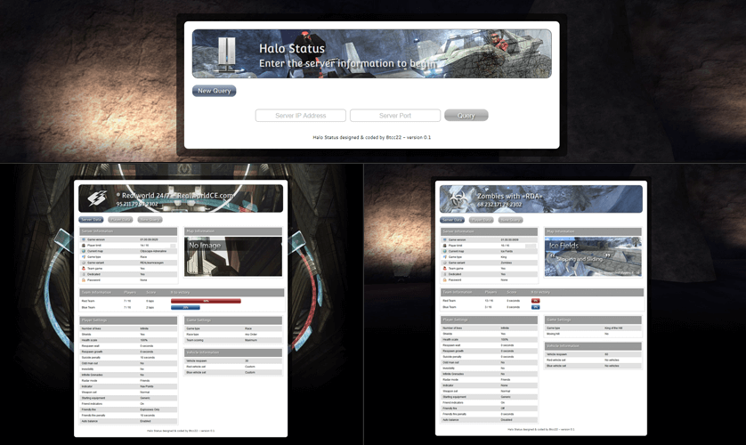

<p align="center">

</p>

HaloStatus is a script for displaying real-time game information from Halo PC and Halo CE (Custom Edition) servers on a website.

<p align="center">

</p>

## Installation

Simply copy the files from this directory to the desired path on your webserver. No configuration required.

## Usage Notes

To link to a specific server, you can add a hash to the URL. For example:
https://example.com/halostatus/#s=46.249.47.12:2332

If you wish to ensure that visitors cannot query other servers, open `ajax.php` and uncomment (remove the `/*` and `*/`) lines 8 to 30 and optionally comment out the `New Query` button from `index.html`.

## Making Changes

### Code
If you wish to make changes to the Javascript, ensure you either uncomment out the individual files in `index.html` or update the `everything-min.js file`.

### Graphics
Some of the PSDs used to create the assets for the script can be found in `psds.zip`. If you wish to create new map images, use the template provided in `mapinfotemplate.psd`.

## Licence

This script is released under a 'do whatever you want with it, pretty much' license. The only requirements are:
- That you abide by the license terms of by the resources  used in this script (see credits).
- You cannot charge for the use of this script.
- Any redistributions of this script (including modified versions) must be free of charge and must retain a copy of this file with none of the original text modified/removed. If modifications have been made, changes must be listed in this file under a 'modifications' header and it must be made clear that these changes are unofficial (including the author's name/handle will suffice).
- Any redistributions of this script may not make changes to these terms. All future modifications must abide by and include the same terms.
- Although it would be nice to have the credit left intact on the script's page, you may remove it entirely OR append to it but not replace it. See the guideline examples below:

Acceptable (intact):
Script by <original author>.

Unacceptable (replaced):
Script by <non-original author>.

Acceptable (appended):
Script by <original author>. Updates/modifications by <non-original author>.

Unacceptable (replaced):
Updates/modifications by <non-original author>.

## Requirements

PHP 5+ with socket support enabled. See troubleshooting for further information.

## Troubleshooting

### I'm receiving an 'operation not permitted' error.
It's likely that one or more of the socket functions have been disabled by the server administrator. If you are the administrator, you can view a list of disabled functions in your `php.ini` file under `disable_functions`. 

To work around this problem, see below to enable legacy functionality.

### My server doesn't have socket support enabled.
You can enable legacy functionality that works in a similar fashion to older query scripts. 

To do this, open `script/ajax.php` and change the following line:
```php
$query = new QueryServer($buffer, $_POST['ip'], (int) $_POST['port']);
```
to:
```php
$query = new QueryServer($buffer, $_POST['ip'], (int) $_POST['port'], null, 1);
```

It should be noted that this functionality is extremely slow as it will take the length of the specified timeout (default two seconds) to return a response. To lower the timeout, change the fourth argument to a suitable value (one second recommended for legacy functionality):

```php
$query = new QueryServer($buffer, $_POST['ip'], (int) $_POST['port'], 1, 1);
```

### I keep getting 'no reply received' when I know the server is up.
It's possible that your server's configuration is blocking outbound and/or inbound data. Due to the nature of UDP, you will not receive any 'unable to connect' errors.

### The script is occasionally reporting 'no reply received' but otherwise works.
It's possible that the route between your server and the game server is experiencing high packet loss or high latency. If high latency is a persistent issue with your server, you can adjust the script's timeout.

To do this, open `script/ajax.php` and change the following line:

```php
$query = new QueryServer($buffer, $_POST['ip'], (int) $_POST['port']);
```

to:
```php
$query = new QueryServer($buffer, $_POST['ip'], (int) $_POST['port'], 5);
```

The above example sets a 5 second timeout.

### Is there any way to retrieve the raw game server response?
In `script/ajax.php`, `$buffer` will contain the raw server response.

### I've read all of the above but the script still doesn't work or I've found a bug.
Sorry/oops (delete as appropriate). Please open a GitHub issue and I'll see what I can do.

## Bandwidth Usage
Using the default settings, this script will require around 250 bytes/sec (<1MB an hour) from a full server and around 150 bytes/sec from an empty server. This transfer rate should have a negligible impact on the server.

A little more demand is placed on web server due to the data being decoded from flags to strings and HTTP overhead but it's still only around 1KB/sec (guesstimate) for a full server.

If you deem this bandwidth usage to be too great, you can reduce the usage by editing the `index.html` file to decrease the polling rate.

## Credits & Thanks

In no particular order:

### Brian Hurley/Fyrestorm
For his work in decoding the game flags back in 2003.

### Terje Bless
For his work in building the Perl flags decoder which I used as the basis of the PHP flags decoder (`FlagsDecoder.class.php`).
http://cpansearch.perl.org/src/LINK/Net-Halo-Status-0.02/lib/Net/Halo/Status.pm

### SoundManager2
-http://www.schillmania.com/projects/soundmanager2/
-License: BSD license

### Mark James
Silk icon set author.
http://www.famfamfam.com/lab/icons/silk/
License: Creative Commons Attribution 2.5 License.

### jQuery
http://www.jquery.com/
License: GPL or MIT License

### jGrowl
http://stanlemon.net/24
License: GPL or MIT License

### jQuery UI
License: GPL or MIT License

### Crystal Interaction Design Project
Server icon (`server.png`)
http://www.everaldo.com/crystal/
License: LGPL

### Master Chief zombie icon
http://doomcmyk.deviantart.com

### Sound assets
Sound assets from Halo 1.

### Game type icons
Game type icons from Bungie.net.

